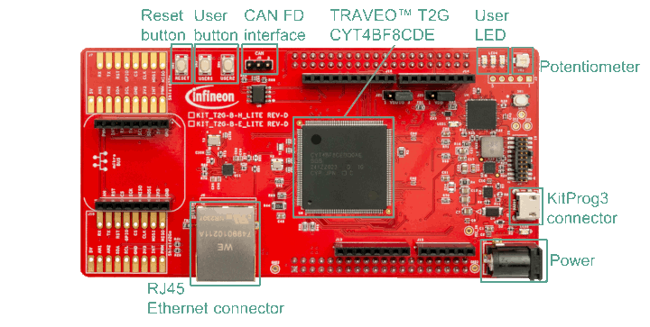

# Basic Supervision of System Calls by HSM

**This code example illustrates the supervision of system calls in T2G devices by a Hardware Secure Module (HSM). In this CE, CM0+ CPU acts as the HSM and CM7 CPU acts as the host. Supervision of system calls is a useful feature to prevent blocking the CM0+ (HSM) inside SROM for a long time due to an unnecessary system call request from the host.**

## Device

The device used in this code example (CE) is:
- [TRAVEO™ T2G CYT4BF Series](https://www.infineon.com/cms/en/product/microcontroller/32-bit-traveo-t2g-arm-cortex-microcontroller/32-bit-traveo-t2g-arm-cortex-for-body/traveo-t2g-cyt4bf-series/)

## Board

The board used for testing is:
- TRAVEO™ T2G evaluation kit ([KIT_T2G-B-H_LITE](https://www.infineon.com/cms/en/product/evaluation-boards/kit_t2g-b-h_lite/))

## Scope of work

The system call infrastructure in T2G devices requires that CM0+ IRQ0 and IRQ1 are enabled and IRQ0 and IRQ1 vector entries in the user CM0+ vector table are identical to the vector entries in the default SROM vector table (addresses 0x00000040 and 0x00000044, respectively). In addition, system calls are serviced when an interrupt is generated by System Interrupt 0 (IPC Interrupt Structure 0 interrupt). Mapping of the System Interrupt 0 to one of the CPU interrupts of CM0+ is done by the *CPUSS_CM0_SYSTEM_INT_CTL0.CPU_INT_IDX [2:0]* bits. The default value of these bits is ‘0’; it means that CM0+ IRQ0, which is connected to the SROM, gets serviced. Therefore, there is no supervision of the system call; the CM0+ core directly jumps to the SROM to execute the system service.

Supervision of the system call can be realized by connecting System Interrupt 0 to another CM0+ CPU interrupt (e.g., IRQ2). This interrupt would then become the system call supervision handler which can then decide if the system call request should be forwarded to SROM or not. Forwarding the system call to the SROM can be done by triggering IRQ0 (which is connected to the SROM) by software, i.e., by writing to the ISPR register.

For example, the supervision handler can check if there is any ongoing crypto operation. If yes, the system call service request can be rejected with an error. If not, the system call request can be forwarded to the SROM. User can freely add any conditions to accept or reject any system service. For example, the CM0+ CPU can also retrieve the opcode of the received system call by checking the IPC registers and granting access to a few system calls while rejecting access to other system calls.

In this CE, host triggers a system call by pressing the user button 1. Each button press alternately triggers the system call EraseSector and GenerateHash. Host sends the system call request to HSM via IPC channel which triggers an interrupt to the HSM. The interrupt calls the supervision handler in HSM. Supervision is realised from the HSM side by a UART interface to the user. The user gets a choice to accept or reject the system call. If user presses ‘Y’ or ‘y’, then the HSM forwards the system call request to SROM by triggering CM0+ CPU interrupt IRQ0 in software. The system call result or status can then be processed by the host. If the HSM rejects the system call request (by pressing any other character in the UART terminal), then HSM immediately releases the IPC channel and sends the error code back to the host.

Note that in this CE, UART is shared by multiple cores (CM0+ and CM7_0). Though it may not be the best way, it works in this CE without issues because both cores alternate with their usage. Users must consider this point if they like to use this project as a basis and want to extend it. 

## Introduction
**Inter Processor Communication (IPC)**

Inter Processor Communication (IPC) structures provides the functionality for multiple processors to communicate and synchronize their activities. For example, IPCs can be used to send messages between host and HSM.

IPCs can be configured to generate notification events after sending a message and generate release events after processing the message that was sent over an acquired IPC channel.

Few IPC channels (data structure and interrupt structure) are reserved for system calls that can be triggered from different interfaces (e.g., CM0, CM7_x, and DAP). It is recommended not to multiplex these channels for normal data transfers to avoid potential conflicts with system calls.

**System calls**

T2G devices offer system calls that are pre-programmed functions residing in SROM. These functions cannot be modified by the user and can be used as it is for various system management operations. There are mainly two categories of system calls:
1. *Flash management system calls* – These system calls provide the ability to program, erase, and test the flash macro.
2. *System management system calls* – These system calls provide the ability to perform system tasks such as blowing eFuse, transitioning the device to SECURE or RMA lifecycle stage, retrieving unique ID of a device and so on.

System calls can be triggered by all CPUs, and by DAP. However, the availability of some system calls and allowed masters that can trigger a system call may have a dependency on the protection state of the device and the system call itself.

Execution of system calls is always done by CM0+ core in a special Protection Context (PC) called PC1.

To trigger a system call, each master must use its dedicated IPC channel structure to configure the system call parameters. For example, the CM7_0 CPU must always use IPC channel 1 to trigger a system call. All masters must use IPC interrupt structure 0 to generate an interrupt for the system call.

**Supervision of system calls**

Since the mechanism involved in executing system calls puts CM0+ CPU to interrupt mode, it may not be required to always service or execute system call coming from different bus masters. For example, in the context of a secured T2G system, it is the primary responsibility of the CM0+ CPU to manage HSM activities.

The ongoing HSM activities at CM0+ CPU must not be interrupted for a long time by a system call request coming from the CM7 CPU. For example, an ongoing crypto operation at CM0+ CPU must not be interrupted by an EraseSector system call request coming from CM7 CPU because EraseSector system call could consume a long time to complete its operation, thereby blocking the CM0+ CPU from completing the crypto operation in time.

The recommended mechanism to handle such issues is to supervise an incoming system call.

It is possible for the HSM CPU to supervise an incoming system call coming from the HSM itself or from other masters (main application or DAP). In general, supervision deals with the acceptance or rejection of an incoming system call. Supervision needs connecting IPC interrupt structure 0 interrupt not directly to SROM interrupt, but to a supervision handler.

More details can be found in [Technical Reference Manual (TRM)](https://www.infineon.com/dgdl/Infineon-TRAVEO_T2G_Automotive_Body_Controller_High_Family_Architecture_Technical_Reference_Manual_TRM-AdditionalTechnicalInformation-v09_00-EN.zip?fileId=8ac78c8c7d0d8da4017d0f95376202c0), [Registers TRM](https://www.infineon.com/dgdl/?fileId=5546d4627600a6bc017600be2aef0004) and [Data Sheet](https://www.infineon.com/dgdl/?fileId=5546d46275b79adb0175dc8387f93228).

## Hardware setup

This CE has been developed for:
- TRAVEO™ T2G evaluation kit lite ([KIT_T2G-B-H_LITE](https://www.infineon.com/cms/en/product/evaluation-boards/kit_t2g-b-h_lite/)) 
 
No changes are required from the board's default settings.

A UART serial connection should be made with the computer via the serial port (KitProg3 connector). Use a terminal emulator to see the output on the screen. In the terminal emulator settings, select the KitProg3 COM port and set the baud rate to 115200.

## Implementation

This CE is a multi-core project which has user code for both CM0+ CPU (HSM) and CM7_0 CPU (Host). On the host side, the software checks if user has pressed the user button 1. If the button is pressed, the host alternately sends the system calls EraseSector and GenerateHash. On the HSM side, the software connects the IPC interrupt structure 0 interrupt (system call interrupt) to supervision handler. This handler checks if the system call should be approved. If the system call is approved, then it is propagated to SROM and the result is sent back to host. If the system call is rejected, then the error is sent back to host.

**CM0+ - STDOUT/STDIN setting**

Initialization of the GPIO for UART is done in the <a href="https://infineon.github.io/retarget-io/html/group__group__board__libs.html#ga4905a76eaea9b40111887f5b6ff7d252"><i>cy_retarget_io_init()</i></a> function.
- Initializes the pin specified by *CYBSP_DEBUG_UART_TX* as UART TX and the pin specified by *CYBSP_DEBUG_UART_RX* as UART RX (these pins are connected to KitProg3 COM port)
- The serial port parameters are 8N1 and 115200 baud

**CM0+ - General Initializations**

Since system call supervision is enabled, the same highest priority must be set for CM0+ interrupts IRQ0 and IRQ1. Start-up would have configured low priority for IRQ0. Setting priorities for the IRQ is done using *[NVIC_SetPriority()](https://arm-software.github.io/CMSIS_5/5.8.0/Core/html/group__NVIC__gr.html#ga5bb7f43ad92937c039dee3d36c3c2798)*. IPC Interrupt Structure 0 interrupt is connected to the supervision handler *superviseSyscallInterrupt* using the function *[Cy_SysInt_Init()](https://infineon.github.io/mtb-pdl-cat1/pdl_api_reference_manual/html/group__group__sysint__functions.html#gab2ff6820a898e9af3f780000054eea5d)*. Supervision handler interrupt is enabled using *[NVIC_EnableIRQ()](https://arm-software.github.io/CMSIS_5/5.8.0/Core/html/group__NVIC__gr.html#ga530ad9fda2ed1c8b70e439ecfe80591f)*. CM0+ also enables the CM7 CPU using *[Cy_SysEnableCM7()](https://infineon.github.io/mtb-pdl-cat1/pdl_api_reference_manual/html/group__group__system__config__cm7__functions.html#gacac741f6dd29eb66dc7e4fb31eef52fe)*.

**CM0+ - main loop**

The endless loop of the code example in main() is empty.  

**CM0+ - Syscall Interrupt Supervision**

*superviseSyscallInterrupt()* is invoked when IPC interrupt structure 0 interrupt gets triggered due to a system call IPC notification request coming from the Host CPU (CM7_0). This function then calls *checkHsmApproval()* function to further process the received system call.

**CM0+ - HSM Approval**

*checkHsmApproval()* retrieves the system call data using the IPC function *[Cy_IPC_Drv_ReadMsgWord()](https://infineon.github.io/mtb-pdl-cat1/pdl_api_reference_manual/html/group__group__ipc__functions.html#gadf7235959bc77bc9d71f6660e315741a)*. Then the function waits for an input from user over UART to accept or reject the system call. The function waits for a character from UART using the function *[cyhal_uart_getc()](https://infineon.github.io/mtb-hal-cat1/html/group__group__hal__uart.html#ga89108b2d339dc9863ec660588e3a4a12)*. The character recieved will be displayed on the terminal using *[cyhal_uart_putc()](https://infineon.github.io/mtb-hal-cat1/html/group__group__hal__uart.html#ga2184202b0b3995fcf625caf9f8c3dc05)*. If user presses ‘Y’ or ‘y’, then the function propagates the system call to SROM by triggering CM0+ IRQ0 in software by setting it to pending using the function *[NVIC_SetPendingIRQ()](https://arm-software.github.io/CMSIS_5/5.8.0/Core/html/group__NVIC__gr.html#ga3b885147ef9965ecede49614de8df9d2)*.
The system call IPC would have been released by SROM in this case after system call execution is complete. If user presses any other character, then the system call is rejected and not propagated to SROM. In this case, the IPC is released by the function using *[Cy_IPC_Drv_ReleaseNotify()](https://infineon.github.io/mtb-pdl-cat1/pdl_api_reference_manual/html/group__group__ipc__functions.html#gae012b59909da4867ac1112f69f9dd3a1)*. The IPC interrupt is also cleared by the function *[Cy_IPC_Drv_ClearInterrupt()](https://infineon.github.io/mtb-pdl-cat1/pdl_api_reference_manual/html/group__group__ipc__functions.html#ga408e08c5842189246a35ca2be89d62ea)*.

**CM7_0 - STDOUT/STDIN setting**

Initialization of the GPIO for UART is done in the <a href="https://infineon.github.io/retarget-io/html/group__group__board__libs.html#ga4905a76eaea9b40111887f5b6ff7d252"><i>cy_retarget_io_init()</i></a> function.
- Initializes the pin specified by *CYBSP_DEBUG_UART_TX* as UART TX and the pin specified by *CYBSP_DEBUG_UART_RX* as UART RX (these pins are connected to KitProg3 COM port)
- The serial port parameters are 8N1 and 115200 baud

**CM7_0 - GPIO pin configuration**

The GPIO port address is calculated based on the port number through *[Cy_GPIO_PortToAddr()](https://infineon.github.io/mtb-pdl-cat1/pdl_api_reference_manual/html/group__group__gpio__functions__init.html#gab0eeafea970eadb4e147ff6d0e3804dc)*.
This data is later used for initialization of GPIO pin.

The GPIO pin (User button 1) is initialized using *[Cy_GPIO_Pin_FastInit()](https://infineon.github.io/mtb-pdl-cat1/pdl_api_reference_manual/html/group__group__gpio__functions__init.html#gaf57c501727276013d3e8974a9fb7d0a7)*.

User button 1 is configured to input mode. It is also associated with an interrupt handler - handleGPIOinterrupt, which is triggered when the button is pressed. The interrupt is set on the falling edge of the signal via *[Cy_GPIO_SetInterruptEdge()](https://infineon.github.io/mtb-pdl-cat1/pdl_api_reference_manual/html/group__group__gpio__functions__interrupt.html#ga0f6123cf8373c2a0c8baf902ecd2e38f)* and configures the pin interrupt to be forwarded to CPU using *[Cy_GPIO_SetInterruptMask()](https://infineon.github.io/mtb-pdl-cat1/pdl_api_reference_manual/html/group__group__gpio__functions__interrupt.html#gaadaa24997de59580bdaf72f26006730a)*. The interrupt is initialized with its interrupt handler through *[Cy_SysInt_Init()](https://infineon.github.io/mtb-pdl-cat1/pdl_api_reference_manual/html/group__group__sysint__functions.html#gab2ff6820a898e9af3f780000054eea5d)*.

**CM7_0 - Data Cache**

The program disables the CM7 Data Cache using the function *[SCB_DisableDCache()](https://arm-software.github.io/CMSIS_5/5.8.0/Core/html/group__Dcache__functions__m7.html#gafe64b44d1a61483a947e44a77a9d3287)*. This is needed for easy processing of the system call at the CM0+ side since CM0+ reads/write data from/to physical SRAM only and not any caches.

**CM7_0 - User input**

When the user button 1 is pressed for the first time, the program requests the system call EraseSector to erase the first work-flash large sector. When the button is pressed for the second time, the program requests the system call GenerateHash to return the device Factory Hash. So, for each press of the user button, the two system calls are alternately requested.

**CM7_0 - main loop**

The endless loop of the CE in *main()* checks if the user button 1 is pressed. For every button press, the loop alternately requests the system calls EraseSector and GenerateHash. System call parameters are stored in the array *syscallScratchbuffer*. The system call is triggered using the IPC function *[Cy_IPC_Drv_SendMsgWord()](https://infineon.github.io/mtb-pdl-cat1/pdl_api_reference_manual/html/group__group__ipc__functions.html#ga60f75f0403a88420eb1268f54b21ed27)*. Then the do-while loop waits till the IPC is released either by the SROM or the HSM. IPC release is checked using *[Cy_IPC_Drv_IsLockAcquired()](https://infineon.github.io/mtb-pdl-cat1/pdl_api_reference_manual/html/group__group__ipc__functions.html#ga1ed2f8f6a0343bdeedbe4f81c0df5e1a)*. The UART com port then displays the result of the system call (if it is approved by the HSM) or displays a failure message if the system call is rejected by HSM.

**CM7_0 - System call trigger request**

The *handleGPIOinterrupt()* function is called when the user button 1 is pressed. This function sets the flag *syscallRequest* to *TRUE*. It increments a variable *syscallFlag* to detect even/odd number of button press events. The handler also clears the triggered interrupt though *[Cy_GPIO_ClearInterrupt()](https://infineon.github.io/mtb-pdl-cat1/pdl_api_reference_manual/html/group__group__gpio__functions__interrupt.html#gad78807d0744e91ba5330ef9ea07817f4)*.

## Run and Test

For this CE, Tera Term terminal is required for displaying outputs and to send data over UART. Install [Tera Term](https://teratermproject.github.io/index-en.html) as instructions in this document is based on this terminal application.

After code compilation, perform the following steps for flashing the device:
1. Connect the board to your PC using the provided USB cable through the KitProg3 USB connector.
2. Open a terminal program and select the KitProg3 COM port. Set the serial port parameters to 8N1 and 115200 baud.
3. To program the board:
    - Select the code example project in the Project Explorer.
    - In the **Quick Panel**, scroll down, and click **[Project Name] Program (KitProg3_MiniProg4)**.
4. After programming, the code example starts automatically. Confirm that the messages are displayed on the UART terminal.
	Note: You can also debug the example to step through the code. In the IDE, use the **[Project Name] Debug (KitProg3_MiniProg4)** configuration in the **Quick Panel**. For details, see the "Program and debug" section in the [Eclipse IDE for ModusToolbox™ software user guide](https://www.infineon.com/dgdl/Infineon-ModusToolbox-Eclipse-IDE-user-guide-UserManual-v16_00-EN.pdf?fileId=8ac78c8c8929aa4d0189bd07dd6113f9&redirId=188241).
5. On the UART terminal, a message will be displayed to press User Button 1. The user can press the user button to invoke the system call.
   
   *Figure 1. Prompt the user to press User Button 1* 
   
6. The user can press the user button 1 and the user will be prompted to accept or reject the system call with Opcode 0x14.

   *Figure 2. User selection to accept or reject system call with Opcode 0x14* 
   
7. User can press ‘Y’ or ‘y’ to approve the system call. If user presses this, then the system call is approved and the system call result is displayed on the terminal.
   
   *Figure 3. User accepts the system call with Opcode 0x14 and result displayed* 
   
8. User can again press user button 1 and the user will be prompted to accept or reject the system call with Opcode 0x1E.

   *Figure 4. User selection to accept or reject system call with Opcode 0x1E* 
   
9. User can press ‘Y’ or ‘y’ to approve the system call. If user presses this, then the system call is approved and the system call result is displayed on the terminal.
   
   *Figure 5. User accepts the system call with Opcode 0x1E and result displayed* 
   
10. User can again press user button 1 and the user will be prompted to accept or reject the system call with Opcode 0x14. User can reject the system call by pressing any other character other than ‘Y’ or ‘y’. In this case a message is displayed stating that the system call is not approved.
   
   *Figure 6. User rejects the system call with Opcode 0x14 and result displayed* 

## References

Relevant Application notes are:
- [AN235305](https://www.infineon.com/dgdl/Infineon-AN235305_GETTING_STARTED_WITH_TRAVEO_TM_T2G_FAMILY_MCUS_IN_MODUSTOOLBOX_TM-ApplicationNotes-v05_00-EN.pdf?fileId=8ac78c8c8b6555fe018c1fddd8a72801) - GETTING STARTED WITH TRAVEO™ T2G FAMILY MCUS IN MODUSTOOLBOX™
- [AN228680](https://www.infineon.com/dgdl/Infineon-AN228680_-_Secure_system_configuration_in_TRAVEO_TM_T2G_family-ApplicationNotes-v07_00-EN.pdf?fileId=8ac78c8c7cdc391c017d0d3e888b67e2) - Secure system configuration in TRAVEO™ T2G family
- [AN224432](https://www.infineon.com/dgdl/Infineon-AN224432_-_Multi_core_handling_in_TRAVEO_T2G_family-ApplicationNotes-v08_00-EN.pdf?fileId=8ac78c8c7cdc391c017d0d3e423267c2) - Multi core handling in TRAVEO™ T2G family

Relevant Knowledge Base Articles (KBAs) are:
- [Supervision of System Calls: TRAVEO™ T2G MCU](https://community.infineon.com/t5/Knowledge-Base-Articles/Supervision-of-System-Calls-TRAVEO-T2G-MCU/ta-p/399281)
- [Explanation of the System Call Interface](https://community.infineon.com/t5/Knowledge-Base-Articles/System-Call-Interface-in-TRAVEO-T2G-MCU/ta-p/451853)
- [TRAVEO™ T2G MCU: Protection Context (PC) Requirements for System Calls](https://community.infineon.com/t5/Knowledge-Base-Articles/TRAVEO-T2G-MCU-Protection-Context-PC-Requirements-for-System-Calls/ta-p/744708)

ModusToolbox™ is available online:
- <https://www.infineon.com/modustoolbox>

Associated TRAVEO™ T2G MCUs can be found on:
- <https://www.infineon.com/cms/en/product/microcontroller/32-bit-traveo-t2g-arm-cortex-microcontroller/>

More code examples can be found on the GIT repository:
- [TRAVEO™ T2G Code examples](https://github.com/orgs/Infineon/repositories?q=mtb-t2g-&type=all&language=&sort=)

For additional training, visit our webpage:
- [TRAVEO™ T2G training](https://www.infineon.com/cms/en/product/microcontroller/32-bit-traveo-t2g-arm-cortex-microcontroller/32-bit-traveo-t2g-arm-cortex-for-body/traveo-t2g-cyt4bf-series/#!trainings)

For questions and support, use the TRAVEO™ T2G Forum:
- <https://community.infineon.com/t5/TRAVEO-T2G/bd-p/TraveoII>
